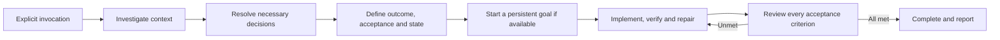

# Large Task Orchestrator

[English](README.md) | [简体中文](README.zh-CN.md) · [MIT License](LICENSE)

An **explicit-only Codex skill** that turns a complex request into a complete task definition, verifiable acceptance criteria, an execution plan, and recoverable task state. When the current host supports persistent goals, it creates one and starts working without another request to continue.

You describe the outcome and answer decisions that only you can make. Codex investigates the project, fills in the task document, and carries the authorized work through implementation and verification.



## What it does

- Investigates existing context, implementation, tests, configuration, and project rules before asking questions.
- Asks only consequential questions that cannot be answered through investigation or reasonable engineering judgment.
- Maintains one current task entry point, preferably in the project's existing status document.
- Tracks acceptance criteria with evidence, decisions, assumptions, progress, remaining work, and blockers.
- Creates or reuses a persistent goal when supported; verifies actual tool results instead of treating a flag or a written command as startup.
- Continues executable work with an explicit limitation notice when goal tooling is unavailable.
- Respects analysis-only requests, pauses, runtime restrictions, existing user decisions, and authorization boundaries.

It complements applicable `AGENTS.md` instructions. You do not need the author's private configuration or project files. It does not grant permission for production changes, spending, deletion, or external messages beyond what the user has authorized.

## Install

Requirements: a Codex host that supports local skills, Git to clone this repository, and Python 3.10+ for the installer. Runtime use of this instruction-based skill does not itself require Python or third-party packages.

```shell
git clone https://github.com/2770578984-ai/large-task-orchestrator.git
cd large-task-orchestrator
python scripts/install.py --language en
```

For Chinese instructions and the Chinese display name **大型任务编排**:

```shell
python scripts/install.py --language zh-CN
```

The installer uses `$CODEX_HOME/skills/large-task-orchestrator` when `CODEX_HOME` is set, otherwise `~/.codex/skills/large-task-orchestrator`. It copies the selected skill, UI metadata, goal reference, task template, and license. It refuses to overwrite an existing path.

For the user skill location documented by Codex, or another explicit location:

```shell
python scripts/install.py --language en --dest /absolute/path/to/.agents/skills/large-task-orchestrator
```

On Windows, pass a full path to `--dest`, such as `C:/path/to/.agents/skills/large-task-orchestrator`. Inspect and back up an existing installation before replacing it or changing language. Keep only one installed copy with this skill name. Codex normally discovers changes automatically; reopen the app if its skill selector is stale. See the [official skill documentation](https://learn.chatgpt.com/docs/build-skills).

## Use

Select the skill in Codex or invoke it explicitly:

```text
$large-task-orchestrator
Migrate this service to the new storage adapter while preserving the public API.
Investigate the existing implementation and tests, establish acceptance criteria,
and complete the migration and necessary verification.
```

Invoking the skill explicitly requests automatic persistent-goal creation once the task is ready. You do not need a separate goal command. A request such as “analyze and plan only; do not implement yet” keeps the work within that scope.

Both language packages use the same internal name. `SKILL.md` is the English entry point; `SKILL.zh-CN.md` is the Chinese source. The installer places the chosen version at the required `SKILL.md` filename. It does not install two competing skills or load both languages at once.

The runtime policy is:

```yaml
policy:
  allow_implicit_invocation: false
```

Ordinary complex requests do not implicitly activate it. Reading or reviewing the skill is also not an invocation.

## State and recovery

The skill reuses an existing task-status section. If none exists, it creates a fixed `CURRENT_TASK.md` or, for Chinese tasks, `当前大型任务.md` in the project. The state includes background, the outcome, current facts, requirements, exclusions, constraints, confirmed decisions, assumptions, acceptance, plan, progress, completed and remaining work, blockers, and validation.

State stays in the task's workspace, outside the installed skill. During recovery, Codex checks recorded decisions and actual files or runtime evidence before continuing. Old completion marks are not accepted when their evidence has become invalid.

## Persistent goals and limits

Some Codex hosts expose `get_goal`, `create_goal`, and `update_goal`. This skill inspects the current tool contracts, creates a goal only in the explicit invocation context, and reads back the actual state. It does not invent an API or a budget. Existing unfinished goals, pauses, and usage limits remain protected.

Installing a skill cannot provide missing runtime tools. Where goal tooling is unavailable, it records and explains that fact, preserves the task contract, and continues available work under the host and project instructions. A skill is not a background service and does not guarantee work after the app closes. See the [goal guide](https://learn.chatgpt.com/use-cases/follow-goals).

## Repository and validation

| English | Chinese | Purpose |
| --- | --- | --- |
| [SKILL.md](SKILL.md) | [SKILL.zh-CN.md](SKILL.zh-CN.md) | Workflow instructions |
| [Goal integration](references/persistent-goals.md) | [目标接入](references/persistent-goals.zh-CN.md) | Runtime goal handling and fallback |
| [Task template](assets/current-task-template.md) | [任务模板](assets/current-task-template.zh-CN.md) | Recoverable task state |
| [UI metadata](agents/openai.yaml) | [界面元数据](agents/openai.zh-CN.yaml) | Display name and invocation policy |

For maintainers:

```shell
python -m pip install -r requirements-dev.txt
python -m unittest discover -s tests -v
python scripts/validate.py
```

The package checks exercise installation of both languages, one discoverable entry point, resource links, refusal to overwrite existing files, and invocation metadata. They do not prove model behavior or semantic equivalence of translations; those require review and isolated behavior checks.

The original Chinese edition was exercised with explicit and ordinary requests, analysis-only scope, state recovery, restricted goal tooling, and a real goal lifecycle from creation to completion. The two implementation fixtures passed 16 and 7 application tests; these were **23 fixture tests, not 23 independent skill scenarios**. Multi-hour runs, forced context compaction, and scheduling after app closure were not established by those checks. Raw private conversation traces are not included in this repository.

## Contributing and license

Keep both languages behaviorally aligned and retain explicit-only invocation, verification evidence, and authorization boundaries. Report a reproducible failure or propose a focused change through GitHub. Record changes and validation in [WORKLOG.md](WORKLOG.md).

Released under the [MIT License](LICENSE).
